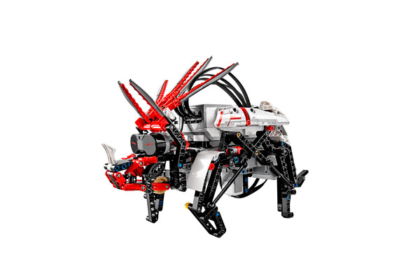

# Dinor3x

> Designed by Lasse Stenbæk Lauesen
>
> This charming robotic triceratops dinosaur is capable of walking and turning on all fours.

[Building Instructions](https://www.lego.com/cdn/cs/set/assets/bltad10c02978864265/DINOR3X.pdf)

[Robo Manual](https://robomanuals.com/product/dinor3x-lego-mindsorms-ev3)
- [Program](https://drive.google.com/file/d/1zze0o3vQYfuUp6344jySBYva7JVEFd5S/view)

[YouTube](https://www.youtube.com/watch?v=eG5xdZ3l1AQ)

