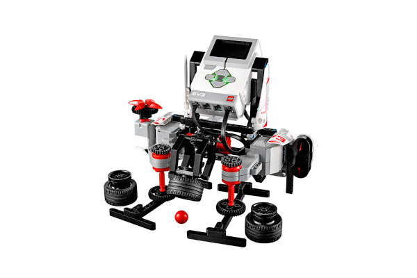

# EV3 Game

> Designed by Ricardo Oliveira
> 
> This robot is all set to play tricks on you. Hide the red ball under the shell, use the IR Beacon to set your level, and watch the robot shuffle and hide the ball – but where? Challenge your friends to see who can find the red ball first!

[Building Instructions](https://www.lego.com/cdn/cs/set/assets/bltced0f5f5980c6a3d/EV3GAME.pdf)

[Robo Manual](https://robomanuals.com/product/ev3game)
- [Program](https://drive.google.com/file/d/1BKRVa_VyC3TB2XBzI5PK-WDhAQ1C0Gmb/view)

[YouTube](https://www.youtube.com/watch?v=WGYj1XN0c3I)

