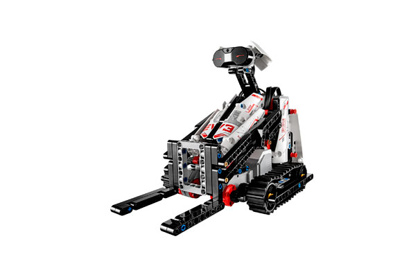

# Bobb3e

> Designed by Kenneth Ravnshøj Madsen
>
> This remote controlled Bobcat® can be steered to move and lift objects with the control buttons on the IR Beacon.

[Building Instructions](https://www.lego.com/cdn/cs/set/assets/blt1e45d9c2a9800e3c/BOBB3E.pdf)

[Robo Manual](https://robomanuals.com/product/bobb3e)
- [Program](https://drive.google.com/file/d/1TOrwT-3yNVMfwcPgBpjhP4vF8CEw6PTL/view)

[YouTube](https://www.youtube.com/watch?v=i3jsJiVKYsg)

