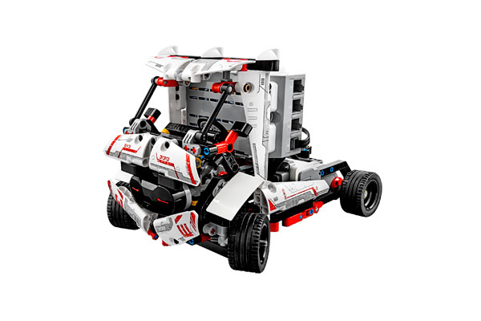

# Rac3 Truck

> Designed by Laurens Valk.
>
> Want a remote controlled truck? Got it! This is one fun cool ride. You can modify the truck to make it go faster by adding gears, and you can add a custom-built trailer so the truck can be used as a transport vehicle.

[Building Instructions](https://www.lego.com/cdn/cs/set/assets/blt8d8677b8321b803e/RAC3_TRUCK.pdf)

[Robo Manual](https://robomanuals.com/product/rac3-truck)
- [Program](https://drive.google.com/file/d/1FaDnl3nShd-hhJEx_6ifOqo7hPQ-Sqs7/view)

[YouTube](https://www.youtube.com/watch?v=3Rtb21QFJeo)

