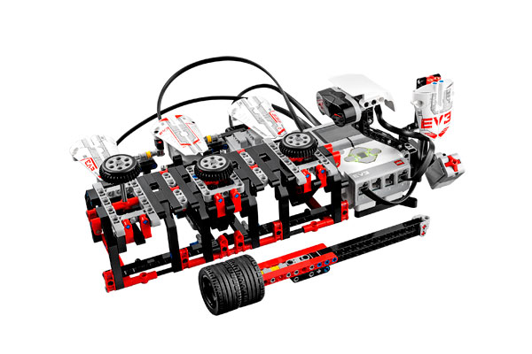

# Wack3m

> Designed by Martyn Boogaarts
> 
> This is an arcade-style game that tests your reaction speed. The robot pops up disks that you have to whack as quickly as possible using the wack-wheel hammer. Challenge your friends and see who wackedy-wacks the fastest!

[Building Instructions](https://www.lego.com/cdn/cs/set/assets/bltdb2f687cb4aa5b97/WACK3M.pdf)

[Robo Manual](https://robomanuals.com/product/wack3m)
- [Program](https://drive.google.com/file/d/1aUsrYvtFU4dH1jplb7UC1g-xDyEzdV4y/view)

[YouTube](https://www.youtube.com/watch?v=ksojLbHrhJ8)

